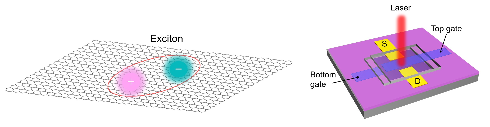
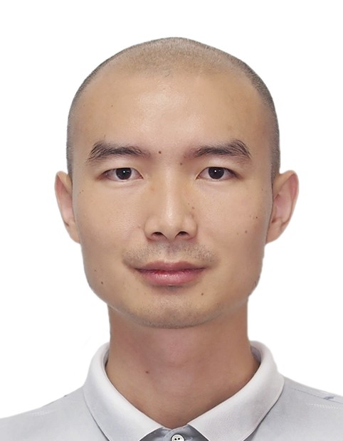

# Welcome to Qi X Lab 

When the size of a material is reduced to the nanoscale, its properties change, and quantum phenomena begin to emerge. These changes can have both positive and negative effects on the applications of the material. For example, in a single unit of a chip, the field-effect transistor, when its size is reduced to the nanoscale, thermal effects, short-channel effects, and quantum effects may cause the device's performance to approach its limit or even begin to decline. When two-dimensional semiconductors transition from bulk to a single layer, their bandgap increases due to quantum confinement effects. When free excitons are confined in a nanoscale quantum well, the light they emit changes from converging to diverging, and they transform from ordinary light sources to quantum light sources. Studying the physical phenomena of materials at the nanoscale and their device applications not only allows us to discover, summarize, and apply physical laws but also has a significant impact on the overall development of science and technology and social progress in our country.

## 1. Research Topics of the Qi X Lab

#### Low-dimensional semiconductor optics

1.  Fluorescence upconversion 
2.  Quantum emission control 
3.  Interlayer exciton control 
4.  Electron-phonon interactions
5.  Defect-phonon interactions

#### Low-dimensional semiconductor optoelectronic devices

1.  Photodetectors 

2. Photovoltaic devices 

3. Functional optoelectronic devices

## 2. Introduction to the Group's Advisor

### About Associate Professor Qixing Wang

**Qixing Wang**, Ph.D., Associate Professor, and Ph.D. supervisor. He is the leader of the Nanophysics and Device Research Group at Xiamen University. His research interests include low-dimensional semiconductor optoelectronic devices and optics. Each year, he recruits 1-2 Ph.D. students in condensed matter physics, semiconductor physics, and semiconductor device physics ("application-assessment system") and 2-3 master's students. 

**Email**: [phyqxw@xmu.edu.cn](mailto:phyqxw@xmu.edu.cn) 

**Personal academic webpage**: [Google Scholar](https://scholar.google.com/citations?user=bog64TcAAAAJ)

**Office**:  Haiyun Park • Physics Building, No.222, Xiamen University.

## 3. Publications
Before 2023

1. S. Yang, S. Fecher, Q. Wang, M. Kühne, and J. H. Smet*, Device Level Reversible Potassium Intercalation into Bilayer Graphene, **2D Mater. 2022, 9, 025020**.

22. Y. Zhang, D. Zhao, Q. Wang, and J. H. Smet*, In situ Raman Spectroscopy across Superconducting Transition of Liquid-Gated MoS2, **Appl. Phys. Lett. 2022, 120, 053106**.

21. Q. Wang, J. Maisch, F. Tang, D. Zhao, S. Yang, R. Joos, S. L. Portalupi, P. Michler, and J. H. Smet*, Highly Polarized Single Photons from Strain-Induced Quasi-1D Localized Excitons in WSe2, **Nano Lett. 2021, 21, 7175–7182**.

20. Q. Wang*, and A. T. S. Wee*, Upconversion Photovoltaic Effect of WS2/2D Perovskite Heterostructures by Two-Photon Absorption, ACS Nano 2021, 15, 10437–10443.

19. Q. Wang, and A. T. S. Wee*, Photoluminescence Upconversion of 2D Materials and Applications, **J. Phys. Condens. Matter 2021, 33, 223001**.

18. Q. Wang#, Q. Zhang#, X. Luo#, J. Wang, R. Zhu, Q. Liang, L. Zhang, J. Z. Yong, C. P. Y. Wong, G. Eda, J. H. Smet, and A. T. S. Wee*, Optoelectronic Properties of a van der Waals WS2 Monolayer/2D Perovskite Vertical Heterostructure, **ACS Appl. Mater. Interfaces 2020, 12, 45235-45242**.

17. Z. Chen#, Q. Zhang#, M. Zhu#, X. Wang, Q. Wang, A. T. S. Wee, K. P. Loh, G. Eda*, and Q.‐H. Xu*, Synthesis of Two‐Dimensional Perovskite by Inverse Temperature Crystallization and Studies of Exciton States by Two‐Photon Excitation Spectroscopy, **Adv. Funct. Mater. 2020, 30, 2002661**.

16. R. Zhu#, W. Zhang#*, W. Shen, P. K. J. Wong, Q. Wang, Q. Liang, Z. Tian, Y. Zhai, C.-W. Qiu, and A. T. S. Wee*, Exchange Bias in van der Waals CrCl3/Fe3GeTe2 Heterostructures, **Nano Lett. 2020, 20, 5030-5035**.

15. Q. Liang, Q. Zhang, J. Gou, T. Song, Arramel, H. Chen, M. Yang, S. X. Lim, Q. Wang, R. Zhu, N. Yakovlev, S. C. Tan, W. Zhang*, K. S. Novoselov, and A. T. S. Wee*, Performance Improvement by Ozone Treatment of 2D PdSe2, **ACS Nano 2020, 14, 5668-5677**.

14. Q. Wang#, Q. Zhang#, X. Zhao#, Y. J. Zheng, J. Wang, X. Luo, J. Dan, R. Zhu, Q. Liang, L. Zhang, PK J. Wong, X. He, Y. L. Huang, X. Wang, S. J Pennycook, G. Eda, and Andrew T. S. Wee*, High-Energy Gain Upconversion in Monolayer Tungsten Disulfide Photodetectors, **Nano Lett. 2019, 19, 5595–5603**.

13. X. Yin#, M. Yang#, C. S. Tang, Q. Wang, L. Xu, J. Wu, P. E. Trevisanutto, S. Zeng, X. Y. Chin, T. C. Asmara, Y. P. Feng, A. Ariando, M. Chhowalla, S. J. Wang*, W. Zhang*, A. Rusydi*, and A. T. S. Wee*, Modulation of New Excitons in Transition Metal Dichalcogenide‐Perovskite Oxide System, **Adv. Sci. 2019, 6, 1900446**.

12. Y. J. Zheng#, Y. Chen#, Y. L. Huang, P. K. Gogoi, M.-Y. Li, L.-J. Li, P. E Trevisanutto, Q. Wang, S. J Pennycook*, A. T. S. Wee*, and S. Y. Quek*, Point Defects and Localized Excitons in 2D WSe2, **ACS Nano 2019, 13, 6050-6059**.

11. Q. Liang, Q. Wang, Q. Zhang, J. Wei, S. X. Lim, R. Zhu, J. Hu, C. Lee, C. H. Sow, W. Zhang*, and A. T. S. Wee*, High Performance, Room Temperature, Ultrabroadband Photodetectors Based on Air-stable P dSe2, **Adv. Mater. 2019, 31, 1807609**.

10. X. Yin#, C. S. Tang#, W. Kong#, C. Li#, Q. Wang, L. Cao, M. Yang, Y.-H. Chang, D. Qi, F. Ouyang, S. J. Pennycook, P. Y. Feng, M. B. H. Breese, S. J. Wang, W. Zhang*, A. Rusydi*, and A. T. S. Wee*, Unravelling High-Yield Phase-Transition Dynamics in Transition Metal Dichalcogenides on Metallic Substrates, **Adv. Sci., 2019, 6, 1802093**.

9. Q. Wang#, Q. Zhang#, X. Zhao#, X. Luo, C. P. Y. Wong, J. Wang, D. Wan, T. Venkatesan, S. J. Pennycook, K. P. Loh, G. Eda, and A. T. S. Wee*, Photoluminescence Upconversion by Defects in Hexagonal Boron Nitride, **Nano Lett. 2018, 18, 6898-6905**.

8. Z. Song, Q. Wang, M.-Y. Li, L.-J. Li, Y. J. Zheng, Z. Wang, T. Lin, D. Chi, Z. Ding*, Y. L. Huang*, and A. T. S. Wee*, Liquid-solid Surface Phase Transformation of Fluorinated Fullerene on Monolayer Tungsten Diselenide, **Phys. Rev. B 2018, 97, 134102**.

7. Q. Wang, J. Guo, Z. Ding, D. Qi, J. Jiang, Z. Wang, W. Chen, Y. Xiang, W. Zhang*, and A. T. S. Wee*, Fabry-Perot Cavity-Enhanced Optical Absorption in Ultrasensitive Tunable Photodiodes Based on Hybrid 2D Materials, **Nano Lett. 2017, 17, 7593-7598**.

6. D. Qi, Q. Wang, Ch. Han, J. Jiang, Y. Zheng, W. Chen, W. Zhang*, and A. T. S. Wee*, Reducing the Schottky Barrier between Few-Layer MoTe2 and Gold, **2D Mater. 2017, 4, 045016**.

5. X. Yin#, Q. Wang#, L. Cao#, C. S. Tang, X. Luo, Y. Zheng, L. M. Wong, S. J. Wang, S. Y. Quek, W. Zhang*, A. Rusydi*, and A. T. S. Wee*, Tunable Inverted Gap in Monolayer Quasi-Metallic MoS2 Induced by Strong Charge Lattice Coupling, **Nat. Commun. 2017, 8, 486**.

4. P. K. Gogoi*, Z. Hu, Q. Wang, A. Carvalho, D. Schmidt, X. Yin, Y.-H. Chang, L.-J. Li, C. H. Sow, A. H. C. Neto, Mark B. H. Breese, A. Rusydi*, and A. T. S. Wee*, Oxygen Passivation Mediated Tunability of Trion and Excitons in MoS2, **Phys. Rev. Lett. 2017, 119, 077402**.

3. Arramel*, X. Yin, Q. Wang, Y. J. Zheng, Z. Song, M. H. b. Hassan, D. Qi, J. Wu, A. Rusydi, and A. T. S. Wee*, Molecular Alignment and Electronic Structure of N,N’-Dibutyl-3,4,9,10-perylene-tetracarboxylic-diimide Molecules on MoS2 Surfaces, **ACS Appl. Mater. Interfaces 2017, 9, 5566 - 5573**.

2. J. Jiang, C. P. Y. Wong, J. Zou, S. Li, Q. Wang, J. Chen, D. Qi, H. Wang, G. Eda, D. H. C. Chua, Y. Shi, W. Zhang*, and A. T. S. Wee*, Two-step Fabrication of Single-layer Rectangular SnSe Flakes, **2D Mater. 2017, 4, 021026**.

1. W. Zhang*, Q. Wang, Y. Chen, Z. Wang, and A. T. S. Wee*, Van der Waals Stacked 2D Layered Materials for Optoelectronics, **2D Mater. 2016, 3, 022001**.
