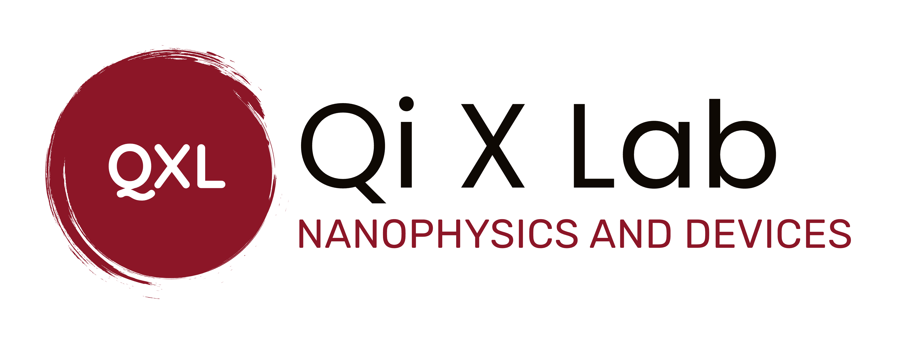

# Welcome to Qi X Lab 

** When** the size of a material is reduced to the nanoscale, its properties change, and quantum phenomena begin to emerge. These changes can have both positive and negative effects on the applications of the material. For example, in a single unit of a chip, the field-effect transistor, when its size is reduced to the nanoscale, thermal effects, short-channel effects, and quantum effects may cause the device's performance to approach its limit or even begin to decline. When two-dimensional semiconductors transition from bulk to a single layer, their bandgap increases due to quantum confinement effects. When free excitons are confined in a nanoscale quantum well, the light they emit changes from converging to diverging, and they transform from ordinary light sources to quantum light sources. Studying the physical phenomena of materials at the nanoscale and their device applications not only allows us to discover, summarize, and apply physical laws but also has a significant impact on the overall development of science and technology and social progress in our country.

## 1. Research Topics of the Qi X Lab

#### Low-dimensional semiconductor optics

1.  Fluorescence upconversion 
2.  Quantum light source emission control 
3.  Interlayer exciton control 
4.  Electron-phonon interactions
5.  Defect-phonon interactions

#### Low-dimensional semiconductor optoelectronic devices

1.  Photodetectors 

2. Photovoltaic devices 

3. Functional optoelectronic devices

## 2. Introduction to the Group's Advisor

### About Associate Professor Wang Qixing

**Wang Qixing**, Ph.D., Associate Professor, and Ph.D. supervisor. He is the leader of the Nanophysics and Device Research Group at Xiamen University. He was selected for the "Xiamen University Nanqiang Outstanding Young Talent Plan (Category B)". His research interests include low-dimensional semiconductor optoelectronic devices and optics. He has published more than 20 SCI papers in international high-impact journals such as Nat. Commun., Nano Lett., and ACS Nano. Each year, he recruits 1-2 Ph.D. students in condensed matter physics, semiconductor physics, and semiconductor device physics ("application-assessment system") and 2-3 master's students. 

**Email**: [phyqxw@xmu.edu.cn](mailto:phyqxw@xmu.edu.cn) 

**Personal academic webpage**: [Qixing Wang](https://cpst.xmu.edu.cn/ info/1217/11780.htm)

**Office**:  Haiyun Park • Physics Building, No.222, Xiamen University.

## 3. Representative Publications

1. Q. Wang, J. Maisch, F. Tang, D. Zhao, S. Yang, R. Joos, S. L. Portalupi, P. Michler, and J. H. Smet*, Highly Polarized Single Photons from Strain-Induced Quasi-1D Localized Excitons in WSe2, **Nano Lett. 2021, 21, 7175–7182**.
2. Q. Wang*, and A. T. S. Wee*, Upconversion Photovoltaic Effect of WS2/2D Perovskite Heterostructures by Two-Photon Absorption, **ACS Nano 2021, 15, 10437–10443**.
3. Q. Wang, and A. T. S. Wee*, Photoluminescence Upconversion of 2D **Materials and Applications, J. Phys. Condens. Matter 2021, 33, 223001**.
4. Q. Wang#, Q. Zhang#, X. Luo#, J. Wang, R. Zhu, Q. Liang, L. Zhang, J. Z. Yong, C. P. Y. Wong, G. Eda, J. H. Smet, and A. T. S. Wee*, Optoelectronic Properties of a van der Waals WS2 Monolayer/2D Perovskite Vertical Heterostructure, **ACS Appl. Mater. Interfaces 2020, 12, 45235-45242**.
5. Q. Wang#, Q. Zhang#, X. Zhao#, Y. J. Zheng, J. Wang, X. Luo, J. Dan, R. Zhu, Q. Liang, L. Zhang, PK J. Wong, X. He, Y. L. Huang, X. Wang, S. J Pennycook, G. Eda, and Andrew T. S. Wee*, High-Energy Gain Upconversion in Monolayer Tungsten Disulfide Photodetectors, **Nano Lett. 2019, 19, 5595–5603**.
